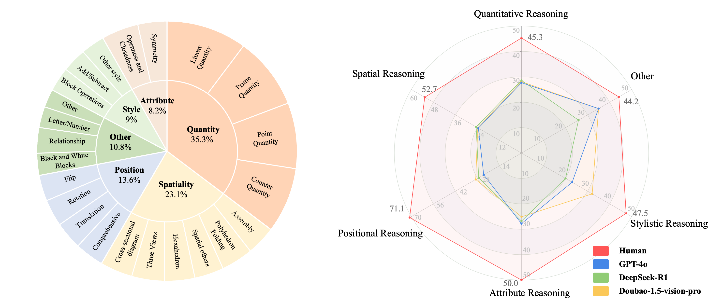
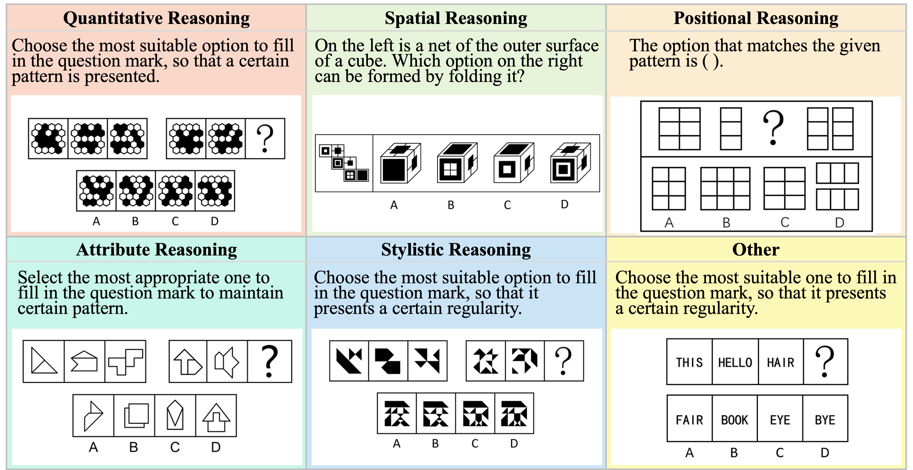
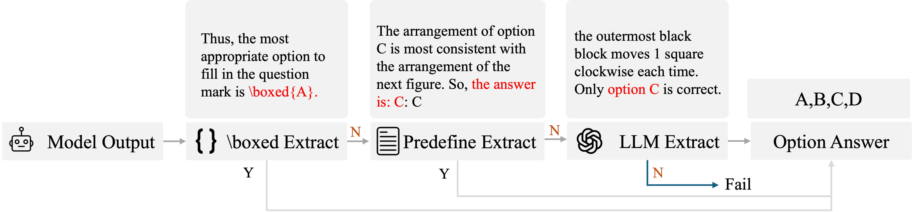

# VisuLogic: A Benchmark for Evaluating Visual Reasoning in Multi-modal Large Language Models

**A Challenging Visual-centric Benchmark for Evaluating Multimodal Reasoning in MLLMs!**

Paper, training datasets, training codes and model checkpoints are coming!

For more details, please refer to the project page with dataset exploration and visualization tools: [https://visulogic-benchmark.github.io/VisuLogic/](https://visulogic-benchmark.github.io/VisuLogic/).

# VisuLogic Benchmark

[**🌐 Homepage**](https://visulogic-benchmark.github.io/VisuLogic) | [**🏆 Leaderboard**](https://visulogic-benchmark.github.io/VisuLogic/) | [**📖 Paper**](http://arxiv.org/abs/2504.15279) | [**🤗 Benchmark**](https://huggingface.co/datasets/VisuLogic/VisuLogic) | [**💻 Eval Code**](https://huggingface.co/datasets/VisuLogic/VisuLogic) | [**🤗 Train Data**](https://huggingface.co/datasets/VisuLogic/VisuLogic) | [**💻 Train Code**](https://github.com/VisuLogic-Benchmark/VisuLogic-Train)


## 🔔News

- **🔥[2025-04-08] Release the benchmark and the codes! 🚀**
## ✅ To-do
- [x] Release the benchmark dataset and eval codes
- [x] Release training codes
- [x] Release the paper
- [x] Release the training dataset
- [x] Release model ckpts


## 📖 Introduction
VisuLogic is a newly designed benchmark aimed at evaluating the visual reasoning capabilities of Multi-modal Large Language Models (MLLMs), independent of textual reasoning processes. It features carefully constructed visual reasoning tasks spanning multiple categories, divided into six types based on required reasoning skills (e.g., Quantitative Reasoning, which involves understanding and deducing changes in the quantity of elements in images). Unlike existing benchmarks, VisuLogic emphasizes vision-based inference rather than simple visual recognition or text generation, significantly increasing its complexity and making it an effective tool for assessing the visual reasoning abilities of multimodal models.

## 🌟 Key Features

- 🚀 **Visuo-Logical Challenge**  
  The first benchmark to integrate **visual perception** with **logical reasoning**, enabling authentic multimodal evaluation.
  
- 🛠️ **Rigorous Design**  
  Includes **1,000 meticulously curated questions**, spanning **6 domains** and **23 subcategories**, for comprehensive performance evaluation.
  
- 📝 **Anti-Linguistic Shortcut**  
  Designed to avoid linguistic biases, ensuring tasks rely on **genuine visual reasoning** rather than shortcuts.

- 👤 **Human-Aligned Evaluation**  
  - **Human Accuracy**: >50.0%  
  - **State-of-the-Art (SOTA) MLLMs Accuracy**: <30%

## 🖼️  Examples of VisuLogic

## Installation & Preparation
### 🛠️ Default Installation
For InternVL series, QwenVL series, glm-4v, ovis2, mplug-om3, llava-onevision
```bash
pip install -r requirements.txt
```
### 🛠️ For Specific Models
#### minicpm-o Installation
```bash
pip install -r requirements.txt
pip install transformers==4.44.2
```
#### llava Installation
```bash
pip install -r requirements.txt
pip install transformers==4.37
```
#### sharegpt4v Installation
> For more details, please refer to this [link](https://huggingface.co/Lin-Chen/ShareGPT4V-7B).
```bash
pip install -r requirements.txt
pip install transformers==4.37
```

### 📂 Prepare Benchmark Data
1. Download huggingface dataset in https://huggingface.co/datasets/VisuLogic/VisuLogic
2. unzip images.zip
```
|- ...
|- data.jsonl
|- images/ (unzip from images.zip)
  |- 00000.png
  |- 00001.png
```


## 🚀 Evaluate Dedfault Models
For example, just find the corresponding model and execute its script.
```bash
sh scripts/eval_internvl.sh
```
## 🔧 Evaluate Your Own Model

VisuLogic provides a clean and extensible framework to evaluate custom models. You only need to add & change 2 files

### Steps to Add Your Model.
1. add `model/mymodel.py` with template as following:
```python
from models.base_model import BaseModel
class mymodel(BaseModel):
    def __init__(self, model_path: str, user_prompt: str = None):
      pass

    def predict(self, input_data: Any) -> Any:
      """
        Model prediction interface
        Args:
            input_data: 
              input_data['text'] # question text
              input_data['image_path'] # image path of question
      """
        pass
    
    @property
    def name(self) -> str:
        """Model name"""
        pass
```
2. modified `model/__init__.py`
```python
...
from models.mymodel import mymodel
def load_model(args):
  ...
  elif 'mymodel' in args.model_path.lower():
    model = mymodel(model_path = args.model_path,
                    user_prompt = args.user_prompt)
  ...
  return model
```
3. run scripts
```bash
mkdir -p outputs/
python evaluation/eval_model.py \
    --input_file path/to/data.jsonl \
    --output_file outputs/output_file.jsonl \
    --model_path mymodel \
    --judge_api_key sk-xxx
```

## 🛠️ Pipeline of Evaluation

VisuLogic evaluates model accuracy by combining boxed, predefined, and LLM-based extraction methods to produce a single choice (a/b/c/d), then compares it with the ground-truth label to determine correctness.
## 📩 Contact
- Jiahao Wang: wjhwdscience@stu.xjtu.edu.cn
- Weiye Xu: ustcxwy0271@mail.ustc.edu.cn

## 📜 Citation

**BibTeX:**
```bibtex
@misc{visulogic,
    title        = {VisuLogic: A Benchmark for Evaluating Visual Reasoning in Multi-modal Large Language Models},
    author       = {VisuLogic-Benchmark},
    howpublished = {\url{https://github.com/VisuLogic-Benchmark/VisuLogic-Eval}},
    year         = {2025},
    note         = {Accessed: 2025-04-08}
}
```
🎉 Thank you for your interest in VisuLogic! We hope this benchmark helps drive advancements in multimodal visual reasoning! 🚀
